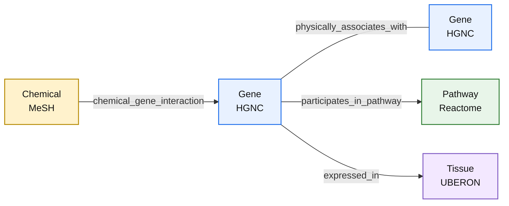

<div align="center">

# NetEM-Rebuild

### A reproducible heterogeneous human biological network for disease-module and disease-gene research

[](https://github.com/Alireza-Koohzad/netem-rebuild/tree/dataset-v1.0.0)


**NetEM-Rebuild Core Graph V1.0.0** integrates curated gene identity, physical gene interactions, chemical–gene interactions, pathway membership, and baseline tissue expression into a source-locked, provenance-preserving heterogeneous graph for computational disease research.

[Dataset overview](#dataset-at-a-glance) · [Graph schema](#graph-schema) · [Data sources](#data-sources) · [Reproducibility](#reproducibility) · [Quality control](#quality-control) · [Release integrity](#release-integrity)

</div>

---

## Overview

NetEM-Rebuild is a modern reconstruction of the heterogeneous biological-network concept used in the original NetEM project. The current release is designed as a **stable biological Core Graph** that can later be combined with disease-specific seed genes, labels, evaluation sets, and leakage-control masks without rebuilding the underlying network for every disease.

The frozen V1.0.0 graph contains four node types:

- **Gene** — canonicalized to HGNC
- **Chemical** — canonicalized to MeSH
- **Pathway** — Reactome human pathways
- **Tissue** — UBERON anatomical entities derived from Bgee

and four biological relation types:

- **Gene–Gene** physical association
- **Chemical–Gene** curated interaction
- **Gene–Pathway** pathway membership
- **Gene–Tissue** baseline expression

> [!IMPORTANT]
> **Disease is not a node type in Core Graph V1.0.0.** No final target disease has been selected yet. Disease profiles, seed genes, labels, and held-out evaluation sets are intentionally planned as separate experiment-layer sidecars.

---

## Why this dataset?

Many disease-module and candidate-gene methods depend strongly on the quality of the biological network supplied to the model. NetEM-Rebuild therefore treats data engineering as part of the scientific method rather than as a preprocessing afterthought.

The V1 release emphasizes:

- **Reproducibility** — versioned source snapshots and SHA-256 verification
- **Stable biological identity** — canonical HGNC, MeSH, Reactome, and UBERON identifiers
- **Explicit provenance** — source evidence retained on processed edges where useful
- **Modularity** — each biological source has an independent adapter
- **Leakage awareness** — disease-specific supervision remains outside the frozen Core
- **Independent QC** — raw-to-processed checks were repeated independently of production adapters
- **Deterministic release metadata** — `data/datapackage.json` is byte-for-byte reproducible

---

## Dataset at a glance

### Nodes

| Node type | Canonical namespace | Count | Processed resource |
|---|---|---:|---|
| Gene | HGNC | **19,297** | `data/processed/nodes/genes.tsv` |
| Chemical | MeSH | **9,601** | `data/processed/nodes/chemicals.tsv` |
| Pathway | Reactome | **1,633** | `data/processed/nodes/pathways.tsv` |
| Tissue | UBERON | **301** | `data/processed/nodes/tissues.tsv` |
| **Total** |  | **30,832** |  |

### Edges

| Relation | Source | Target | Count | Share of graph |
|---|---|---|---:|---:|
| `physically_associates_with` | Gene | Gene | **422,581** | 26.17% |
| `chemical_gene_interaction` | Chemical | Gene | **595,993** | 36.92% |
| `participates_in_pathway` | Gene | Pathway | **47,326** | 2.93% |
| `expressed_in` | Gene | Tissue | **548,568** | 33.98% |
| **Total** |  |  | **1,614,468** | 100% |

### Connectivity

| Metric | Value |
|---|---:|
| Active genes in union graph | **19,251 / 19,297 (99.76%)** |
| Orphan Core genes | **46** |
| Connected components | **47** |
| Giant component | **30,786 nodes** |
| Giant-component coverage | **99.85%** |
| Non-giant components | **46 singleton genes** |

---

## Graph schema



The arrows above show the **canonical storage orientation** of edge tables. Storage direction does not automatically imply biological causality. In particular, `Chemical -> Gene` is a canonical representation of a curated interaction, not a universal causal statement.

---

## Data sources

| Layer | Source | Frozen version / snapshot | Main V1 policy |
|---|---|---|---|
| Gene identity | [HGNC](https://www.genenames.org/) | 2026-09-04 snapshot | approved **protein-coding** genes only |
| Gene–Gene | [STRING](https://string-db.org/) | v12.5 | human **physical** network, `combined_score >= 400` |
| Chemical–Gene | [CTD](https://ctdbase.org/) | report created 2026-09-29 | human, Core-mapped, binary/simple curated interactions |
| Gene–Pathway | [Reactome](https://reactome.org/) | v97 | NCBI2Reactome primary mapping, TAS + IEA, pathway size >= 5 |
| Gene–Tissue | [Bgee](https://www.bgee.org/) | v15.2 | Gold + present + pure UBERON, Top-30 tissues/gene with rank ties |

The exact source filenames, local paths, hashes, and source metadata are frozen in:

```text
configs/sources_v1.toml
```

and mirrored in the release manifest:

```text
data/datapackage.json
```

<details>
<summary><strong>HGNC — Gene universe</strong></summary>

The full approved HGNC snapshot contains **45,045** approved records. Core V1 intentionally restricts the modeling universe to protein-coding genes:

```text
HGNC locus group = protein-coding gene
HGNC locus type  = gene with protein product
```

Final Core gene universe:

```text
19,297 genes
```

Identifier availability within the Core:

```text
Ensembl present: 19,254
NCBI Gene present: 19,296
Both present: 19,253
```

HGNC is the canonical identity. Gene symbols are labels, not primary keys.

</details>

<details>
<summary><strong>STRING — Physical Gene–Gene network</strong></summary>

STRING v12.5 human physical interactions are mapped from STRING protein IDs into the frozen HGNC Core using three reconciliation routes:

```text
1. direct HGNC alias
2. Ensembl gene -> HGNC
3. NCBI Gene -> HGNC
```

Ambiguous protein mappings are rejected rather than manually corrected.

Key audit values:

```text
STRING physical proteins:        18,565
resolved to Core:                18,063
ambiguous/conflicting:                2
unmapped:                           315
HGNC gene pairs pre-threshold:  633,904
final score>=400 edges:         422,581
active Core genes:               17,409
```

For multiple STRING protein pairs collapsing onto the same HGNC pair, the highest-`combined_score` protein pair is retained as the representative record and `supporting_protein_pairs` records multiplicity.

</details>

<details>
<summary><strong>CTD — Chemical–Gene interactions</strong></summary>

CTD interactions are restricted to Homo sapiens and mapped from NCBI Gene IDs into the frozen HGNC Core.

V1 retains curated binary/simple interactions and removes complex/nested or cotreatment-style records. High-degree chemicals are **not** pruned.

```text
strict retained curated rows: 696,222
chemical nodes:                 9,601
final Chemical-Gene edges:    595,993
active Core genes:             18,977
Core coverage:                  98.34%
```

Canonical chemical identity is stored as:

```text
MESH:<ChemicalID>
```

CAS RN is optional; **4,475** retained chemicals have no CAS value.

</details>

<details>
<summary><strong>Reactome — Gene–Pathway membership</strong></summary>

Production mapping uses `NCBI2Reactome.txt`; `Ensembl2Reactome.txt` is used as a cross-check rather than unioned with the production mapping.

The two mapping routes agreed strongly during forensic audit:

```text
NCBI pairs: 48,701
ENSG pairs: 48,750
shared:     48,525
Jaccard:     99.18%
```

V1 retains both Reactome evidence codes encountered in the source:

```text
TAS
IEA
```

and applies a minimum retained pathway size of five mapped Core genes.

Final layer:

```text
Pathways:          1,633
Gene-Pathway edges: 47,326
Active Core genes: 11,191
Core coverage:      57.99%
```

Reactome disease pathways are **retained and annotated**, not globally removed:

```text
is_disease_pathway = true / false
retained disease pathways = 185
```

Target-disease-specific leakage masking can therefore be performed later at experiment time.

</details>

<details>
<summary><strong>Bgee — Gene–Tissue baseline expression</strong></summary>

The Bgee audit showed that its anatomical-entity universe contains UBERON anatomy, CL cell types, and post-composed CL∩UBERON entities. Core V1 defines `Tissue` narrowly and therefore retains **pure UBERON** entities only.

Primary expression policy:

```text
Expression = present
Call quality = gold quality
Entity namespace = UBERON only
Exclude UBERON:0000468 (multicellular organism)
Selection = Top 30 tissues per gene by lowest expression rank
Boundary policy = retain all exact rank ties
```

Why Top-30? All Gold/UBERON present calls produced over 3.2 million Gene–Tissue edges and would dominate the heterogeneous graph. Per-gene rank selection reduced density while preserving gene coverage.

Final layer:

```text
Tissues:           301
Gene-Tissue edges: 548,568
Active Core genes: 18,903
Core coverage:      97.96%
Median gene degree: 30
Maximum gene degree: 40
Maximum tissue degree: 5,172
Maximum retained FDR: 0.01
```

The Top-30 threshold is a **project engineering decision derived from audit results**, not a Bgee recommendation.

</details>

---

## Processed resources and schemas

### Node tables

#### `genes.tsv`

```text
canonical_id
symbol
name
ensembl_gene_id
ncbi_gene_id
```

#### `chemicals.tsv`

```text
canonical_id
name
cas_rn
```

#### `pathways.tsv`

```text
canonical_id
name
is_disease_pathway
```

#### `tissues.tsv`

```text
canonical_id
name
```

### Edge tables

#### `gene_gene.tsv`

```text
source_id
target_id
relation
combined_score
experimental_score
database_score
textmining_score
supporting_protein_pairs
```

#### `chemical_gene.tsv`

```text
source_id
target_id
relation
supporting_curated_rows
supporting_pubmed_count
pubmed_ids
interaction_actions
gene_forms
```

#### `gene_pathway.tsv`

```text
source_id
target_id
relation
evidence_codes
supporting_mapping_rows
```

#### `gene_tissue.tsv`

```text
source_id
target_id
relation
bgee_gene_id
call_quality
fdr
expression_score
expression_rank
self_observation_count
descendant_observation_count
```

All final edge resources use the logical primary key:

```text
(source_id, target_id, relation)
```

---

## Repository layout

```text
netem-rebuild/
├── configs/
│   ├── dataset_v1.toml
│   ├── data_contract_v1.toml
│   └── sources_v1.toml
│
├── data/
│   ├── raw/                  # immutable upstream snapshots; Git-ignored
│   ├── interim/              # intermediate products; Git-ignored
│   ├── processed/            # generated dataset resources; Git-ignored
│   │   ├── nodes/
│   │   └── edges/
│   └── datapackage.json      # deterministic release descriptor
│
├── src/netem_rebuild/
│   ├── sources/
│   │   ├── hgnc.py
│   │   ├── stringdb.py
│   │   ├── ctd.py
│   │   ├── reactome.py
│   │   └── bgee.py
│   └── release.py
│
├── pyproject.toml
├── uv.lock
└── README.md
```

> [!NOTE]
> Raw and processed biological files are intentionally not ordinary Git-tracked assets. Reproduction is driven by frozen source metadata, checksums, configs, and source adapters.

---

## Reproducibility

### 1. Clone the repository

```bash
git clone https://github.com/Alireza-Koohzad/netem-rebuild.git
cd netem-rebuild
git checkout dataset-v1.0.0
```

### 2. Prepare Python

The project is pinned to Python 3.12 and uses [`uv`](https://docs.astral.sh/uv/) for environment management.

```bash
uv sync
uv run python --version
```

Expected major/minor version:

```text
Python 3.12
```

### 3. Obtain frozen upstream source snapshots

Download the exact source files defined in:

```text
configs/sources_v1.toml
```

Place each file at its configured `local_path`.

The adapters verify source SHA-256 values before processing. Do not substitute a newer moving source snapshot and expect a byte-identical V1 build.

### 4. Rebuild the dataset

Run adapters in this order:

```bash
uv run python src/netem_rebuild/sources/hgnc.py
uv run python src/netem_rebuild/sources/stringdb.py
uv run python src/netem_rebuild/sources/ctd.py
uv run python src/netem_rebuild/sources/reactome.py
uv run python src/netem_rebuild/sources/bgee.py
uv run python src/netem_rebuild/release.py
```

### 5. Verify the release descriptor

Expected manifest:

```text
data/datapackage.json
```

Expected SHA-256 for Core Graph V1.0.0:

```text
fb7ccbf5345a79ab2bcc6a83fda109d1b4676427688fc019f85bb34708380187
```

Linux/macOS:

```bash
sha256sum data/datapackage.json
```

PowerShell:

```powershell
Get-FileHash data\datapackage.json -Algorithm SHA256
```

---

## Quality control

Quality control was performed at three levels.

### Level 1 — Adapter regression guards

Each production adapter validates expected source structure, checksums, key mapping assumptions, final counts, and biological/schema invariants.

### Level 2 — Independent raw-to-processed reconstruction

Critical layers were independently reconstructed from raw files without importing the corresponding production adapter. These checks validated exact node/edge sets and provenance fields.

Examples:

- Reactome: exact node set, exact edge set, evidence codes, support counts, disease annotation
- Bgee: exact Tissue set, exact Gene–Tissue set, original Bgee gene ID, FDR, expression score/rank, observation counts, Top-K tie behavior

### Level 3 — Integrated graph and release QC

The complete graph passed:

```text
GLOBAL NODE-ID UNIQUENESS: OK
EDGE ENDPOINT INTEGRITY: OK
RELATION SCHEMA INTEGRITY: OK
NO DUPLICATE FINAL EDGES: OK
NON-GENE NODE SUPPORT: OK
DISEASE PATHWAY ANNOTATION: OK
GENERIC TISSUE EXCLUSION: OK
```

The release package additionally passed:

```text
RESOURCE HASHES: OK
RESOURCE BYTE SIZES: OK
RESOURCE ROW COUNTS: OK
RESOURCE SCHEMAS: OK
PRIMARY KEYS: OK
FOREIGN KEYS: OK
CONFIG HASHES: OK
SOURCE SNAPSHOT METADATA: OK
RAW SOURCE CHECKSUMS: OK
CORE GRAPH TOTALS: OK
```

All **9 frozen raw source files** were checksum-verified during independent release QC.

---

## Release integrity

| Item | Value |
|---|---|
| Dataset version | `1.0.0` |
| Git tag | `dataset-v1.0.0` |
| Release commit | `a51d93acedea94e7d0deb9e98448aea9339c661c` |
| Manifest | `data/datapackage.json` |
| Manifest SHA-256 | `fb7ccbf5345a79ab2bcc6a83fda109d1b4676427688fc019f85bb34708380187` |
| Data contract version | `1.0.0` |
| Organism | Homo sapiens |
| Taxonomy ID | 9606 |

The manifest was regenerated twice from identical inputs and produced the same SHA-256:

```text
Manifest determinism: OK
```

The package descriptor follows the [Frictionless Data Package](https://specs.frictionlessdata.io/data-package/) model and records resource paths, schemas, byte sizes, hashes, row counts, primary keys, foreign keys, source snapshots, and config hashes.

---

## Disease layer status

**No final disease has been selected in V1.0.0.**

The intended architecture is:

```text
Frozen Core Graph V1.0.0
        │
        ├── disease profiles / ontology mapping
        ├── disease-gene evidence
        ├── seed genes
        ├── held-out positives
        ├── leakage-control masks
        └── independent evaluation resources
```

This design keeps disease-specific supervision separate from the disease-independent biological graph.

Reactome disease pathways remain in the Core Graph with an explicit `is_disease_pathway` flag. Future experiments may mask pathways related to a specific target disease as an ablation/leakage-control strategy instead of permanently deleting all disease pathways from the base dataset.

---

## Modeling notes

The graph is naturally suited to relation-aware heterogeneous models such as heterogeneous GNNs, relation-specific message passing, graph representation learning, or heterogeneous random-walk methods.

A model loader may create reverse relations for convenience, for example:

```text
chemical <-interacted_by_chemical- gene
pathway  <-has_gene--------------- gene
tissue   <-expresses_gene--------- gene
```

These reverse edges are **modeling conveniences**, not new source facts and not part of the canonical release tables.

Other practical considerations:

- edge types are imbalanced, so relation-aware sampling or loss design may be useful;
- Gene is the central bridge type across all four relations;
- Pathway edges are substantially sparser than CTD/Bgee edges;
- 46 frozen Core genes are isolated in V1.0.0;
- directed storage orientation should not automatically be interpreted as causal direction;
- disease-specific labels should not be injected into the Core topology without explicit versioning and leakage analysis.

---

## Key biological semantics

### STRING scores

`combined_score` and channel-specific scores are STRING evidence/confidence scores. They are not downstream model probabilities.

### CTD interactions

`interaction_actions`, `gene_forms`, and PubMed support are retained. `Chemical -> Gene` is a canonical storage convention for this release.

### Reactome evidence

`evidence_codes` may contain:

```text
TAS
IEA
TAS|IEA
```

Both TAS and IEA are retained in primary V1.

### Bgee expression

For Bgee:

- lower `expression_rank` means higher expression;
- V1 uses `present` + `gold quality` calls;
- retained calls have maximum FDR `0.01`;
- `self_observation_count` and `descendant_observation_count` preserve source evidence detail.

---

## Data governance and upstream terms

This repository integrates data from multiple upstream resources. Users should comply with the terms and citation requirements of each original provider.

- **HGNC** data are released under CC0 and attribution is encouraged — [HGNC license](https://hgnc.genenames.org/about/license/)
- **STRING** download data are available under CC BY 4.0 — [STRING access and licensing](https://version-12-5.string-db.org/cgi/access)
- **Reactome annotation data** are available under CC0 — [Reactome license](https://reactome.org/license)
- **Bgee expression-call data** are provided under CC0 — [Bgee expression downloads](https://www.bgee.org/download/gene-expression-calls)
- **CTD** data remain subject to CTD's own usage terms — [CTD](https://ctdbase.org/)

Raw source files are not treated as original work of this repository. NetEM-Rebuild records their versions, locations, hashes, and transformation policies for reproducibility.

---

## Source documentation

Official source documentation used by the build design:

- [HGNC download overview](https://hgnc.genenames.org/download/)
- [HGNC data archive](https://hgnc.genenames.org/download/archive/)
- [STRING](https://string-db.org/)
- [CTD downloads](https://ctdbase.org/downloads/)
- [Reactome downloads](https://reactome.org/download-data)
- [Bgee expression-call documentation](https://www.bgee.org/support/tutorial-expression-call-download-documentation)
- [Frictionless Data Package specification](https://specs.frictionlessdata.io/data-package/)

---

## Versioning policy

Dataset versions follow:

```text
MAJOR.MINOR.PATCH
```

- **PATCH** — bug fix or mapping correction without an intended schema/semantic expansion
- **MINOR** — backward-compatible new source, relation, node type, or other extension
- **MAJOR** — breaking identifier, schema, or biological-semantics change

Core Graph `1.0.0` is frozen. Future disease experiments should be versioned independently rather than silently changing this release.

---

## Roadmap

Current next-stage work is intentionally outside the frozen Core Graph:

- [x] HGNC Core gene universe
- [x] STRING physical Gene–Gene layer
- [x] CTD Chemical–Gene layer
- [x] Reactome Gene–Pathway layer
- [x] Bgee Gene–Tissue layer
- [x] Integrated graph QC
- [x] Deterministic `datapackage.json`
- [x] Git tag `dataset-v1.0.0`
- [ ] Disease feasibility audit
- [ ] Final selection of 2–4 disease targets
- [ ] Disease ontology / identifier harmonization
- [ ] Disease–gene evidence sidecars
- [ ] Leakage-controlled train/validation/test design
- [ ] Heterogeneous GNN / disease-module experiments
- [ ] Baseline comparisons and ablations

---

## Citation

A DOI-backed dataset citation has not yet been assigned. Until a formal archival release is created, please cite the repository and frozen tag.

```bibtex
@misc{koohzad_netem_rebuild_2026,
  author       = {Koohzad, Alireza},
  title        = {NetEM-Rebuild Core Graph V1.0.0},
  year         = {2026},
  howpublished = {GitHub repository},
  url          = {https://github.com/Alireza-Koohzad/netem-rebuild},
  note         = {Dataset tag: dataset-v1.0.0}
}
```

When publishing work using this dataset, please also cite the relevant upstream biological databases used in the specific analysis.

---

## Related scientific context

NetEM-Rebuild is motivated by disease-module discovery in heterogeneous biological networks and is designed to support modern graph-learning approaches while preserving a reproducible biological substrate.

Relevant methodological directions include:

- disease-module discovery and network medicine;
- heterogeneous graph representation learning;
- candidate disease-gene prioritization;
- overlapping functional module discovery;
- positive-unlabeled learning for disease genes;
- pathway- and tissue-aware graph learning;
- source- and relation-level ablation studies.

The current repository focuses first on making the **dataset and its provenance auditable** before introducing disease-specific supervision.

---

## Contributing

For changes to the frozen Core Graph, please open an issue describing:

1. the biological or engineering problem;
2. the affected source/relation;
3. whether the change is a bug fix or a new dataset feature;
4. expected impact on identifiers, schema, counts, and reproducibility;
5. a proposed version increment.

Please do not manually edit files under `data/processed/`.

---

<div align="center">

### NetEM-Rebuild Core Graph V1.0.0

**30,832 nodes · 1,614,468 edges · 4 node types · 4 relations · 99.85% giant-component coverage**

Built for reproducible disease-module research.

</div>
